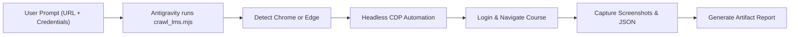

# LMS Crawler & Screenshot Automation Skill

This skill teaches Antigravity how to automatically inspect, authenticate, extract contents, and capture screenshots from Learning Management Systems (Moodle, Blackboard, Canvas, etc.) on **Windows**, **macOS**, and **Linux**.

## Workflow Overview



---

## Operating on Windows

On Windows systems, Antigravity executes shell commands through PowerShell or CMD via `run_command`.

### 1. Browser Discovery on Windows
The bundled script (`crawl_lms.mjs`) automatically searches for:
1. **Microsoft Edge** (`C:\Program Files (x86)\Microsoft\Edge\Application\msedge.exe` or `C:\Program Files\Microsoft\Edge\Application\msedge.exe`) — **Pre-installed on 100% of Windows 10/11 machines**.
2. **Google Chrome** (`C:\Program Files\Google\Chrome\Application\chrome.exe` or `C:\Program Files (x86)\Google\Chrome\Application\chrome.exe` or `%LOCALAPPDATA%\Google\Chrome\Application\chrome.exe`).
3. Custom path via `$env:CHROME_PATH` or `$env:EDGE_PATH`.

> [!TIP]
> No need to install third-party browsers on Windows; Microsoft Edge uses the Chromium engine and natively supports the Chrome DevTools Protocol (CDP).

---

## Execution Instructions for the Agent

When the user gives you a request like:
> *"could you check this LMS and get me some screenshots ? credentials: <url> usuario: <user> password: <pass>"*

Follow these steps:

### Step 1: Prepare the Output Directory
Target an output folder inside the active artifact or scratch directory:
- Artifact scratch: `<appDataDir>/brain/<conversation-id>/screenshots`
- Or local project: `.\lms_output`

### Step 2: Execute the Crawler Script
Run the script using `run_command`:

#### On Windows (PowerShell):
```powershell
node "./skills/lms-crawler/scripts/crawl_lms.mjs" `
  --url "<LMS_URL>" `
  --user "<USERNAME>" `
  --pass "<PASSWORD>" `
  --out "<OUTPUT_DIR>"
```
*Alternatively, you can call `.\skills\lms-crawler\scripts\run_crawler.ps1`.*

#### On macOS / Linux (zsh/bash):
```bash
node "./skills/lms-crawler/scripts/crawl_lms.mjs" \
  --url "<LMS_URL>" \
  --user "<USERNAME>" \
  --pass "<PASSWORD>" \
  --out "<OUTPUT_DIR>"
```

> [!NOTE]
> Network access is required to connect to external LMS websites. If running inside an isolated sandbox, execute with `BypassSandbox: true` upon user authorization.

### Step 3: Verify and Present Results
The script produces:
1. `screenshots/01_initial_landing.png`: Initial page or login screen.
2. `screenshots/02_course_main_viewport.png`: Above-the-fold view of the course.
3. `screenshots/03_course_main_fullpage.png`: Entire stitched course overview.
4. `screenshots/participants_fullpage.png`: Roster of participants and teachers.
5. `screenshots/grades_fullpage.png`: Student gradebook view.
6. `screenshots/dashboard_my_fullpage.png`: User dashboard (`/my/`).
7. `course_data.json`: Structured JSON with syllabus, sections, and activity links.
8. `lms_report.md`: Markdown summary.

### Step 4: Create Artifact for the User
Create or update an artifact (`lms_report.md`) embedding the screenshots using standard markdown syntax:
```markdown

```
Provide the user with direct clickable links to the report and images.

---

## Detailed References

- [Windows Setup & Troubleshooting Guide](./references/windows_guide.md)
- [Tools Used & Architecture](./references/tools_used.md)
